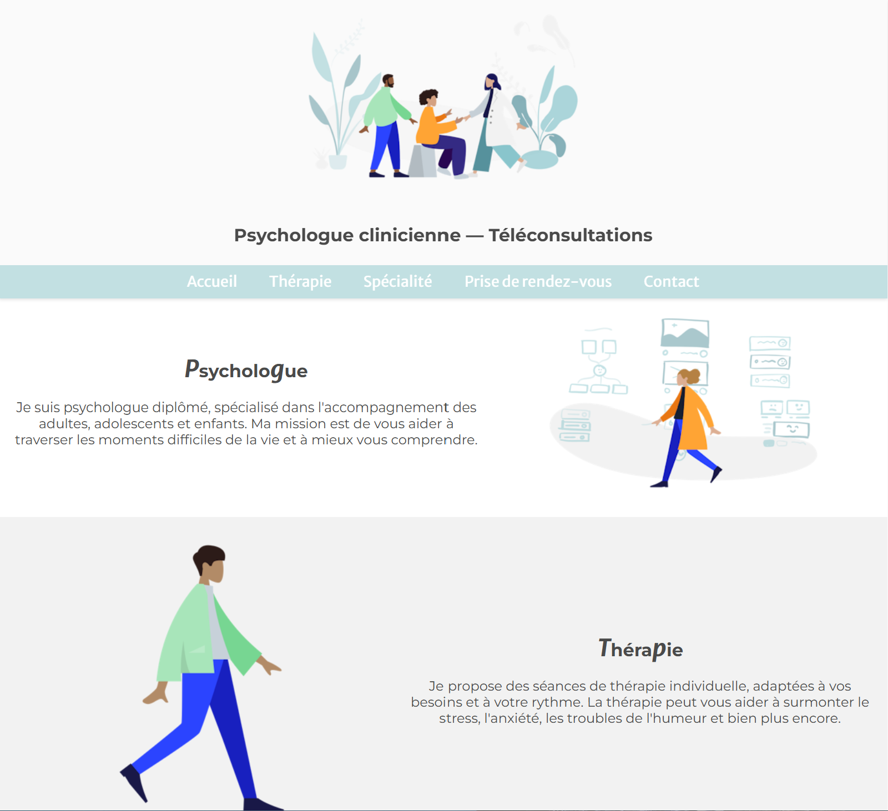

# 🧠 Site Web Vitrine - Psychologue

Ce site a pour but de présenter les services, la spécialité, les modalités de prise de rendez-vous et les coordonnées du professionnel 👩‍⚕️👨‍⚕️.

---

# 🌟 Fonctionnalités principales

📱 Responsive : s’adapte aux smartphones et tablettes
🧭 Navigation fluide grâce au scroll animé
🍪 Accessibilité : éléments interactifs accessibles au clavier

---

# 💻 Technologies utilisées

HTML5 📄
CSS3 🎨
JavaScript (vanilla) ⚙️
Google Fonts - Montserrat 🖋️
Ionicons pour les icônes 📦

# 📷 Aperçu

# Merci pour la visite ! 🫶
